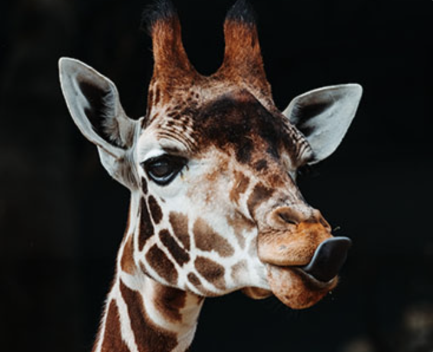
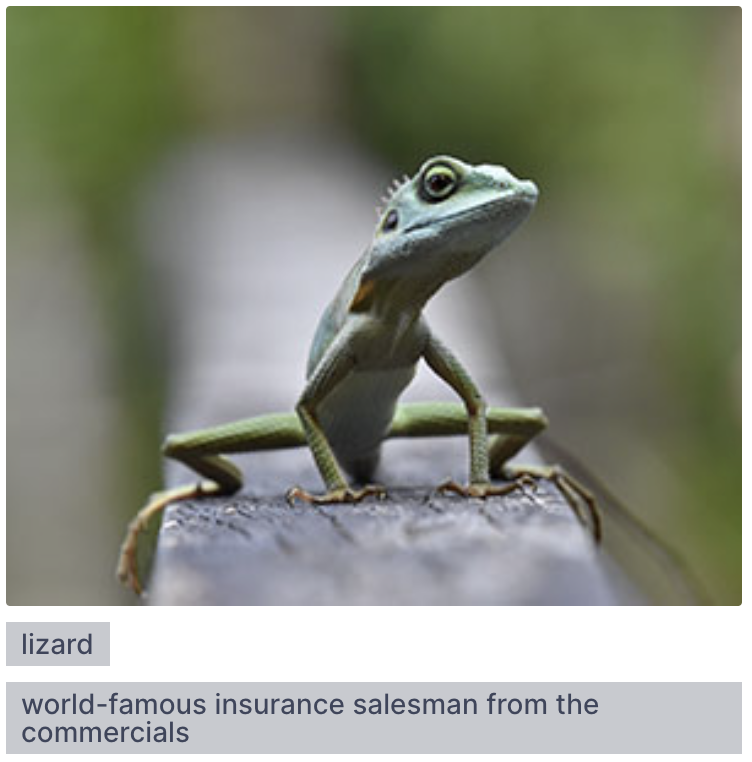
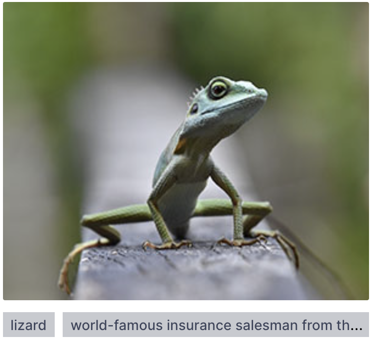

# Unsprinkle — Module 6 workshop

In this workshop, we're going to optimize and improve an existing application.

Using the tricks we learned about typography and images in this module, we'll improve the performance, accessibility, and user experience for Unsprinkle, a photo-sharing application.

---

## Exercise 1: Optimize fonts

This project is using a variable font, but it's quite hefty! Using Google Fonts, swap it out for an optimized version.

Bonus points for self-hosting the optimized font!

## Exercise 2: Improve images

For a photo-heavy site like this one, we can significantly improve the user experience by optimizing the images that appear.

The images in the photo grid and the hero should implement the following optimizations:

1. Serve larger images to users who use high-DPI displays.
2. Serve modern `.avif` images instead of `.jpg` images to users on supported browsers.

**All of the images have already been created for you**. They follow a consistent naming pattern:

```
- photo-name.jpg
- photo-name.avif
- photo-name@2x.jpg
- photo-name@2x.avif
- photo-name@3x.jpg
- photo-name@3x.avif
```

For the hero, you can hardcode these values. For the photo grid, you'll need to use some JavaScript to update the photo names. You can use the `replace` method:

```js
src.replace('.jpg', '@2x.avif');
```

One last thing: the images are a little distorted right now. This happens because our images are all the same size, but they don't share the same aspect ratio.

Here's what the giraffe picture looks like by default:


…And here's what it should look like after your modifications:



## Exercise 3: Accessibility issues

There are several images in this application, and none of them have been given the required "alt" attribute.

Update all images so that they have appropriate alternative text.

There are 11 images in total, including 2 in the `Hero.js` component. Be sure to consider the context (if you weren't able to see the page, what would you want to know about them?).

## Exercise 4: Tag overflow

Each photo has associated tags, shown in small grey boxes below the image:


Some of these items have _very_ long tags:



Update the CSS so that the tags _always fit on 1 line_. If there is too much text, the final tag should have an ellipsis (…).



**This is a challenging exercise.** You'll need to tweak some of the existing CSS (Hint: Flexbox might not be the right layout mode for this)
